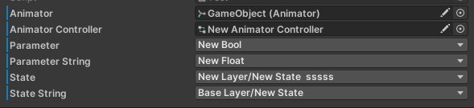

# OdinAnimatorAttributes

## Installation

Put `AnimatorAttributes` folder in project

# Example


```cs
[SerializeField]
private Animator m_animator;
		
[SerializeField]
private RuntimeAnimatorController m_animatorController;

[SerializeField]
[AnimatorParameter(nameof(m_animator))]
private int m_parameter;

[SerializeField]
[AnimatorParameter(AnimatorControllerParameterType.Float, nameof(m_animatorController))]
private string m_parameterString;

[SerializeField]
[AnimatorState(nameof(m_animatorController))]
private int m_state;
	
[SerializeField]
[AnimatorState]
private string m_stateString;
```
